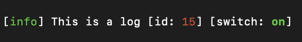
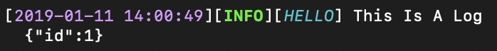

# Built-in Formatters

Hixtory has many built-in formatters to help you easily transform log data. All build-in formatters can be accessed within `Hixtory.formatters`.

___

## Table of contents

- [Add](#add)
- [Remove](#remove)
- [Timestamp](#timestamp)
- [Colorize](#colorize)
- [LowerCase](#lowercase)
- [UpperCase](#uppercase)
- [WordWrap](#wordwrap)
- [Indent](#indent)
- [Print](#print)
- [PrintJson](#printjson)
- [PrintConsole](#printconsole)
- [PrintFile](#printfile)


___


## Add

Adds additional properties to output object. It performs merge operation, so it also can overwrite existing properties.

`formatters.add(data)`

- `data:object`: An object instance which will be merged to meta-data

```javascript
const {createLogger, appenders, formatters} = require('hixtory');
const logger = createLogger({
  targets: {
    console: {
      appender: new appenders.ConsoleAppender(),
      format: formatters.add({id: 1})
    }
  }
});
logger.info('This is a log');
```
```shell
{"level":"info","message":"This is a log","id":1}
```


 
## Remove

Removes properties from output object.

`formatters.remove(...property)`

- `property:string`: Name of the property which will be removed from output data


```javascript
const logger = createLogger({
  targets: {
    console: {
      appender: new appenders.ConsoleAppender(),
      format: formatters.remove('level')
    }
  }
});
logger.info('This is a log');
```
```sh
{"message":"This is a log"}
```
  
  
  
  

## Timestamp

Adds current timestamp to output object. If format argument is present, date value will be formatted to string.

`formatters.timestamp([format])`

- `format:string` (Optional): Date format string. See [fecha](https://www.npmjs.com/package/fecha) for details


```javascript
const logger = createLogger({
  targets: {
    console: {
      appender: new appenders.ConsoleAppender(),
      format: formatters.timestamp('DD MMMM YYYY')
    }
  }
});
logger.info('This is a log');
```
```sh
{"level":"info","message":"This is a log","timestamp":"10 January 2019"}
```
  
  


## Colorize

Adds color data to given output properties.

`formatters.colorize([colors])`

- `colors:{string: string|object|Function}` (Optional): An object representing color values of output properties.


```javascript
const logger = createLogger({
  levels: 'syslog',
  level: 'info', // Default level is info
  targets: {
    console: {
      appender: new appenders.ConsoleAppender(),
      format: [
        formatters.colorize({
          label: 'yellow',
          id: (meta) => meta.id > 10 ? 'red' : 'green',
          switch: {
            on: 'green bold',
            off: 'red bold'
          }
        }),
        formatters.print()
      ]
    }
  }
});
logger.meta({id: 15, switch: 'on'}).info('This is a log');
```

    


## LowerCase

Converts given property or whole output to lover case characters

`formatters.lowerCase(...property)`

- `property:string`: Name of the property which will performed lowerCase operation


```javascript
const logger = createLogger({
  label: 'HELLO',
  targets: {
    console: {
      appender: new appenders.ConsoleAppender(),
      format: formatters.lowerCase('label', 'message')
    }
  }
});
logger.info('This Is A Log');
```
```sh
{"level":"info","label":"hello","message":"this is a log"}
```

If output is converted to string you can use:
`formatters.lowerCase()`

```javascript
const logger = createLogger({
  label: 'HELLO',
  targets: {
    console: {
      appender: new appenders.ConsoleAppender(),
      format: [
        formatters.print(),
        formatters.lowerCase()
      ]
    }
  }
});
logger.info('This Is A Log');
```
```sh
[info][hello] this is a log
```


## UpperCase

Converts given property or whole output to upper case characters

`formatters.upperCase(...property)`

- `property:string`: Name of the property which will performed upperCase operation


```javascript
const logger = createLogger({
  label: 'HELLO',
  targets: {
    console: {
      appender: new appenders.ConsoleAppender(),
      format: formatters.upperCase('label', 'message')
    }
  }
});
logger.info('This Is A Log');
```
```sh
{"level":"info","label":"HELLO","message":"THIS IS A LOG"}
```

If output is converted to string you can use:
`formatters.upperCase()`


```javascript
const logger = createLogger({
  label: 'HELLO',
  targets: {
    console: {
      appender: new appenders.ConsoleAppender(),
      format: [
        formatters.print(),
        formatters.upperCase()
      ]
    }
  }
});
logger.info('This Is A Log');
```
```sh
[INFO][HELLO] THIS IS A LOG
```


## WordWrap

Wraps any string property or whole text output

`formatters.wordWrap([len])`

- `len:number|{string: number}`: A number that will be used as default max length for all properties or an object representing max line lengths


```javascript
const logger = createLogger({
  label: 'HELLO',
  targets: {
    console: {
      appender: new appenders.ConsoleAppender(),
      format: formatters.wordWrap({
        message: 40,
        description: 20
      })
    }
  }
});
logger.meta({description: 'This Is very very very long text. It is better to wrap it.'})
    .info('This Is very very very long text. It is better to wrap it.');
```
```sh
{"level":"info","label":"HELLO",
  "message":"This Is very very very long text. It is\nbetter to wrap it.",
  "description":"This Is very very\nvery long text. It\nis better to wrap\nit."}
```

If output is converted to string you can use:
`formatters.wordWrap([maxLen=80])`


```javascript
const logger = createLogger({
  label: 'HELLO',
  targets: {
    console: {
      appender: new appenders.ConsoleAppender(),
      format: [
        formatters.print(),
        formatters.wordWrap(40)
      ]
    }
  }
});
logger.info('This Is very very very long text. It is better to wrap it.');
```
```sh
[info][HELLO] This Is very very very
long text. It is better to wrap it.
```


## Indent

Indents any string property or whole text output

`formatters.indent([size=2])`

- `size:number|{string: number}`: A number that will be used as default indent size for all properties or an object representing indent sizes


```javascript
const logger = createLogger({
  label: 'HELLO',
  targets: {
    console: {
      appender: new appenders.ConsoleAppender(),
      format: formatters.indent({
        message: 2,
        description: 4
      })
    }
  }
});
logger.meta({description: 'Line1\nLine2\nLine3'})
    .info('Line1\nLine2\nLine3');
```
```sh
{"level":"info","label":"HELLO",
    "message":"Line1\n  Line2\n  Line3",
    "description":"Line1\n    Line2\n    Line3"}
```

If output is converted to string you can use:
`formatters.indent([size])`


```javascript
const logger = createLogger({
  label: 'HELLO',
  targets: {
    console: {
      appender: new appenders.ConsoleAppender(),
      format: [
        formatters.print(),
        formatters.indent(2)
      ]
    }
  }
});
logger.info('Line1\nLine2\nLine3');
```
```sh
[info][HELLO] Line1
  Line2
  Line3
```


## Print

Converts output object to string representation.

`.printJson([fields[, options]])`

- `fields:object` (Optional): An object representing field order and formats 
- `options:object` (Optional): Additional options 
  - `strict:boolean` (Optional): If true, only properties defined in `fields` will be printed. If false (default) additional data will be printed as an json object after message line. 


```javascript
const logger = createLogger({
  label: 'HELLO',
  targets: {
    console: {
      appender: new appenders.ConsoleAppender(),
      format: formatters.print()
    }
  }
});
logger.meta({id: 1}).info('This Is A Log');
```
```sh
[info][HELLO] This Is A Log [id: 1]
```


```javascript
const logger = createLogger({
  label: 'label1',
  level: 'info',
  targets: {
    console: {
      appender: new appenders.ConsoleAppender(),
      format: formatters.print({
        label: ' LBL:%s',
        level: ' LVL:%s',
        timestamp: ' [%s]',
        message: ' %s',
        pet: (v) => v === 'C' ? ': Cat' : ': Dog'
      })
    }
  }
});
logger.meta({pet: 'D', color: 'black', age: 1}).info('What is your pet?');
```
```sh
LBL:label1 LVL:info What is your pet?: Dog
{"color":"black","age":1}
```

```javascript
const logger = createLogger({
  label: 'label1',
  level: 'info',
  targets: {
    console: {
      appender: new appenders.ConsoleAppender(),
      format: formatters.print({
        label: ' LBL:%s',
        level: ' LVL:%s',
        timestamp: ' [%s]',
        message: ' %s',
        pet: (v) => v === 'C' ? ': Cat' : ': Dog'
      }, {strict: true})
    }
  }
});
logger.meta({pet: 'D', color: 'black', age: 1}).info('What is your pet?');
```
```sh
LBL:label1 LVL:info What is your pet?: Dog
```


## PrintJson

Converts output object to string representation using JSON.stringify

`.printJson([replacer[, space]])`
  
- `replacer:Function|Array<string|number>`: A function that alters the behavior of the stringification process, or an array of String and Number objects that serve as a whitelist for selecting/filtering the properties of the value object to be included in the JSON string. If this value is null or not provided, all properties of the object are included in the resulting JSON string. 

- `space:number|string`: A String or Number object that's used to insert white space into the output JSON string for readability purposes. If this is a Number, it indicates the number of space characters to use as white space; this number is capped at 10 (if it is greater, the value is just 10). Values less than 1 indicate that no space should be used. If this is a String, the string (or the first 10 characters of the string, if it's longer than that) is used as white space. If this parameter is not provided (or is null), no white space is used.

```javascript
const logger = createLogger({
  label: 'HELLO',
  targets: {
    console: {
      appender: new appenders.ConsoleAppender(),
      format: formatters.printJson(null, 2)
    }
  }
});
logger.meta({id: 1}).info('This Is A Log');
```
```sh
{
  "level": "info",
  "label": "HELLO",
  "message": "This Is A Log",
  "id": 1
}
```


## printConsole

Combination of `timestamp`, `colorize`, `upperCase`, `print`, `wordWrap`, `indent` formatters for a pretty console output


```javascript
const logger = createLogger({
  label: 'HELLO',
  targets: {
    console: {
      appender: new appenders.ConsoleAppender(),
      format: formatters.printConsole()
    }
  }
});
logger.meta({id: 1}).info('This Is A Log');
```



## printFile

Combination of `timestamp`, `upperCase`, `print`, `indent` formatters for a pretty file output


```javascript
const logger = createLogger({
  label: 'HELLO',
  targets: {
    console: {
      appender: new appenders.ConsoleAppender(),
      format: formatters.printFile()
    }
  }
});
logger.meta({id: 1}).info('This Is A Log');
```
```sh
[2019-01-11 14:04:24][INFO][HELLO] This Is A Log
  {"id":1}
```
